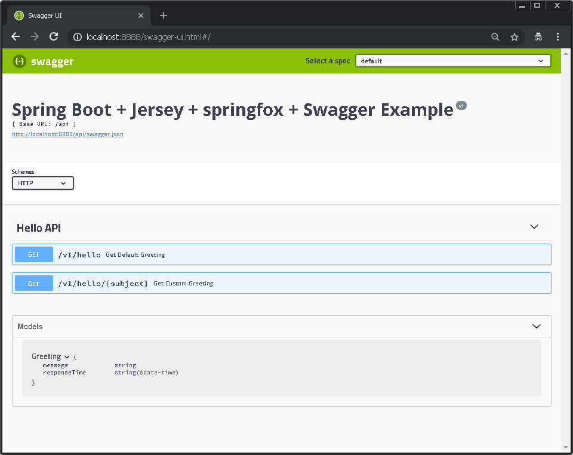

## Simple Spring Boot Greetings App Using Gradle Multi Project

### Build
```sh
./gradlew clean build
```
### Run
```sh
java -jar services/hello-service/build/libs/hello-service-0.0.1-SNAPSHOT.jar
```
### Test 1: Endpoint Without Parameter
```sh
curl -sb -H http://localhost:8888/api/v1/greeting/hello 
```
#### Output
```javascript
{"message":"Hello","responseTime":1511150204373}
```
### Test 2: Endpoint With Parameter
```sh
curl -sb -H http://localhost:8888/api/v1/greeting/hello/rakesh 
```
#### Output
```javascript
{"message":"Hello Rakesh","responseTime":1511150257287}
```


### Actuator Endpoints
```javascript
http://localhost:9999/beans
http://localhost:9999/metrics
http://localhost:9999/info
http://localhost:9999/health

More Details: https://docs.spring.io/spring-boot/docs/current/reference/html/production-ready-endpoints.html
```

### Code Quality
```
./gradlew findbugs
./gradlew pmd
./gradlew checkstyle
./gradlew javancss
./gradlew codeCoverageReport
```

### Swagger (using springfox)
```javascript
http://localhost:8888/swagger-ui.html
```

### Credits / References
SpringFox with Jersey
```javascript
https://github.com/springfox/springfox/issues/1352
https://stackoverflow.com/questions/37640863/springfox-swagger-no-api-docs-with-spring-boot-jersey-and-gradle/38004323#38004323
```
Spring Boot, Jersey, Swagger
```javascript
https://tech.asimio.net/2016/04/05/Microservices-using-Spring-Boot-Jersey-Swagger-and-Docker.html
https://github.com/brightzheng100/springboot-jersey-swagger
```javascript